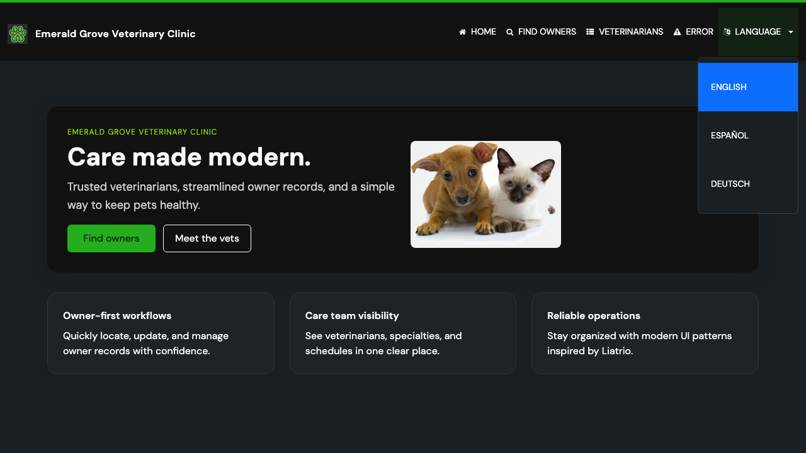

# Task 01 Proofs - Header language selector renders with switching and active-state

## Task Summary

This task adds a language selector to the global header (`fragments/layout.html`)
and proves it renders on every page, lists the three native-name languages
(English / Español / Deutsch), links each option to the current page with the
correct `?lang=` parameter, and marks the currently active language.

## What This Task Proves

- The shared layout renders a `data-testid="language-selector"` dropdown with
  three options whose links carry `?lang=en`, `?lang=es`, and `?lang=de`.
- Requesting the page with `?lang=es` re-renders the current page in Spanish
  (nav label "Inicio") and moves the active marker to the Spanish option.
- The selector label itself is internationalized (`Language` → `Idioma`), and all
  message bundles stay in sync.

## Evidence Summary

- `LanguageSelectorViewTests` (2 tests) passes, asserting the rendered HTML
  contains the selector, the three `?lang=` links, the native labels, the
  Spanish nav label under `?lang=es`, and `aria-current="true"` on the active
  option.
- `I18nPropertiesSyncTest` (2 tests) passes, confirming the new `language` key
  was added to every locale bundle and no hardcoded UI strings were introduced.
- The live-rendered HTML for `/` and `/?lang=es` shows the active marker moving
  to the selected language and the toggle label translating.

## Artifact: View-layer tests pass (RED → GREEN)

**What it proves:** The selector renders with the required links, labels, and
active indicator, and Spanish re-rendering works.

**Why it matters:** This is the automated, repeatable contract for the header
markup that all pages share.

**Command:**

```bash
./mvnw test -Dtest=LanguageSelectorViewTests,I18nPropertiesSyncTest
```

**Result summary:** All 4 tests pass.

```text
Tests run: 2, Failures: 0, Errors: 0, Skipped: 0 -- in ...LanguageSelectorViewTests
Tests run: 2, Failures: 0, Errors: 0, Skipped: 0 -- in ...I18nPropertiesSyncTest
Tests run: 4, Failures: 0, Errors: 0, Skipped: 0
BUILD SUCCESS
```

## Artifact: Live-rendered header HTML (English and Spanish)

**What it proves:** The active language indicator (`active` class +
`aria-current="true"`) follows the selected language, option links are relative
`?lang=` URLs (so the user stays on the current page), and the toggle label is
translated.

**Why it matters:** It demonstrates the actual server output a browser receives,
independent of the test harness.

**Command:**

```bash
curl -s http://localhost:8080/            # English
curl -s "http://localhost:8080/?lang=es"  # Spanish (same session)
```

**Result summary:** On `/`, the English option carries `active` +
`aria-current="true"` and the toggle reads "Language". On `/?lang=es`, the active
marker is on "Español", the toggle reads "Idioma", and nav labels are Spanish.

```html
<!-- GET /  -->
<li class="nav-item dropdown" data-testid="language-selector">
  <a class="nav-link dropdown-toggle" ... title="Language"><span>Language</span></a>
  <ul class="dropdown-menu dropdown-menu-end">
    <li><a class="dropdown-item  active" href="?lang=en" aria-current="true">English</a></li>
    <li><a class="dropdown-item" href="?lang=es">Español</a></li>
    <li><a class="dropdown-item" href="?lang=de">Deutsch</a></li>
  </ul>
</li>

<!-- GET /?lang=es  -->
<li class="nav-item dropdown" data-testid="language-selector">
  <a ... title="Idioma"><span>Idioma</span></a>
  <ul class="dropdown-menu dropdown-menu-end">
    <li><a class="dropdown-item" href="?lang=en">English</a></li>
    <li><a class="dropdown-item  active" href="?lang=es" aria-current="true">Español</a></li>
    <li><a class="dropdown-item" href="?lang=de">Deutsch</a></li>
  </ul>
</li>
```

## Artifact: Expanded dropdown screenshot

**What it proves:** The selector is visible in the header and presents the three
native-name options, with the current language (English) highlighted as active.

**Why it matters:** Confirms the feature is visible and styled in the real UI,
not just in markup.

**Artifact path:** `docs/specs/03-spec-header-language-selector/03-proofs/img/lang-selector-expanded.png`

**Result summary:** The header shows a "LANGUAGE" dropdown expanded to English
(highlighted), Español, and Deutsch.



## Reviewer Conclusion

The selector renders on the shared layout with three native-name options,
correct relative `?lang=` links, and an active indicator that tracks the current
locale — verified by passing view-layer tests, live server HTML, and a UI
screenshot.
