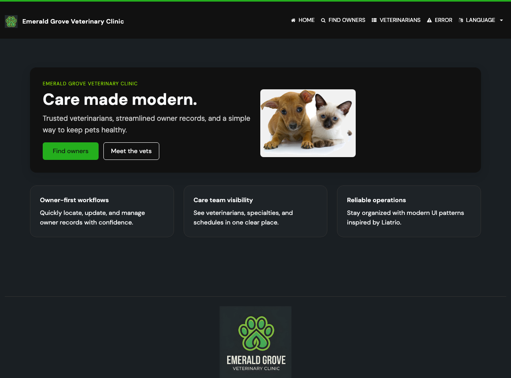
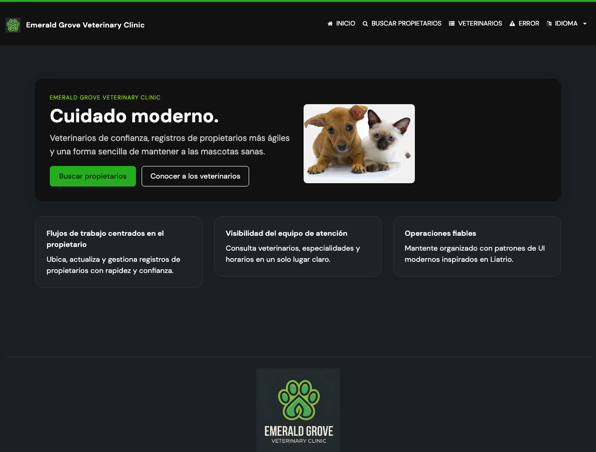

# Task 02 Proofs - End-to-end language switching and session persistence

## Task Summary

This task proves, through a real browser (Playwright), that selecting a language
from the header updates visible UI text, that the choice persists as the user
navigates to other pages within the same session, and that the selector marks
the active language.

## What This Task Proves

- Selecting "Español" from the header changes visible nav text to Spanish
  (acceptance criterion: selecting a language updates UI text).
- After switching, navigating to another page keeps the UI in Spanish
  (acceptance criterion: selection persists across navigation in the session).
- The selector's active option reflects the chosen language.

## Evidence Summary

- `language-selector.spec.ts` passes in Chromium, exercising switch → translated
  text → active-state → cross-navigation persistence in one flow.
- Before/after screenshots show the same home page in English and Spanish.

## Artifact: Playwright spec passes

**What it proves:** The full switch-and-persist journey works end-to-end in a
real browser.

**Why it matters:** This is the acceptance-level proof tied directly to the
issue's acceptance criteria and "Playwright E2E test" requirement.

**Command:**

```bash
cd e2e-tests && npx playwright test language-selector --reporter=list
```

**Result summary:** 1 test passes.

```text
✓  1 [chromium] › tests/features/language-selector.spec.ts › Header language selector ›
   switches UI language, persists across navigation, and marks the active language (1.0s)

  1 passed (4.4s)
```

## Artifact: Home page in English vs Spanish

**What it proves:** The same page renders in two languages depending on the
selection — visible UI text changes.

**Why it matters:** Direct visual confirmation of the issue's "screenshots: same
page shown in two different languages" proof requirement.

**Artifact paths:**

- `docs/specs/03-spec-header-language-selector/03-proofs/img/home-en.png`
- `docs/specs/03-spec-header-language-selector/03-proofs/img/home-es.png`

**Result summary:** English nav reads HOME / FIND OWNERS / VETERINARIANS /
LANGUAGE; after selecting Español the same nav reads INICIO / BUSCAR PROPIETARIOS
/ VETERINARIOS / IDIOMA and the hero becomes "Cuidado moderno."





## Reviewer Conclusion

A real-browser test confirms the selector switches the UI language, the
selection persists across navigation within the session, and the active language
is indicated — satisfying the issue's acceptance criteria and proof requirements.
