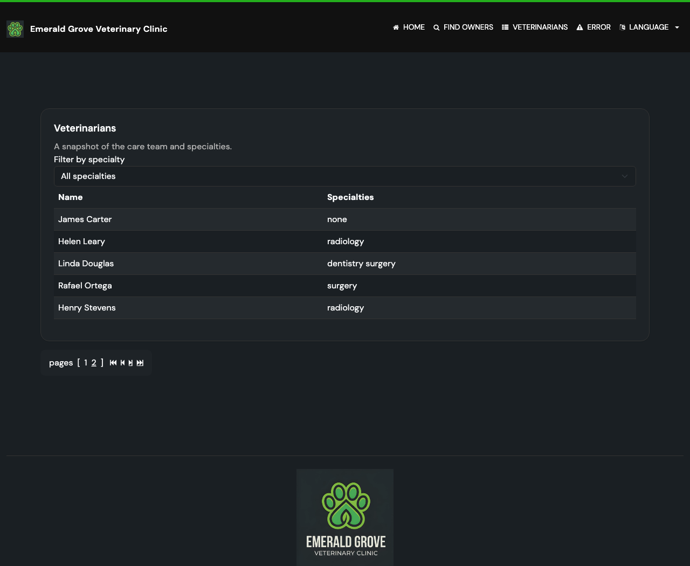
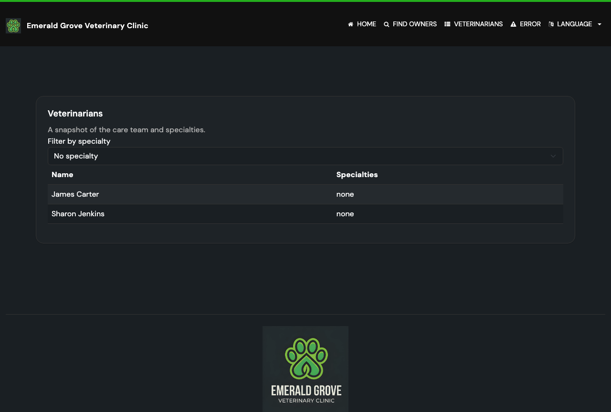

# Task 02 Proofs - Specialty filter UI, pagination param carry, and i18n

## Task Summary

This task proves the Vet Directory renders a working specialty filter dropdown
above the table, marks the active option as selected, carries the filter
through pagination links, and that all new labels are internationalized across
every message bundle.

## What This Task Proves

- The Vet Directory shows a "Filter by specialty" dropdown listing "All
  specialties", each available specialty (dentistry, radiology, surgery), and
  "No specialty".
- Selecting a specialty shows only matching vets and marks that option selected.
- The "No specialty" option shows only vets with no specialty.
- New i18n keys exist in all bundles, keeping `I18nPropertiesSyncTest` green.

## Evidence Summary

- `VetControllerTests` + `I18nPropertiesSyncTest` pass (11 tests), including the
  rendered-`selected`-option assertion and the bundle-sync check.
- Three screenshots show the default (All), surgery, and No-specialty views with
  the dropdown reflecting each state.

## Artifact: Rendered selected-option + i18n sync tests

**What it proves:** The template renders `<select name="specialty">` with the
active option marked `selected`, and every message bundle contains the new keys.

**Why it matters:** Guards both the active-state UX requirement and the
project's no-partial-translations rule enforced by `I18nPropertiesSyncTest`.

**Command:**

```bash
./mvnw test -Dtest=VetControllerTests,I18nPropertiesSyncTest
```

**Result summary:** All 11 tests pass;
`testSelectedSpecialtyOptionIsMarkedSelectedInDropdown` confirms the rendered
`<option value="surgery" selected...>`, and `checkI18nPropertyFilesAreInSync`
confirms `vets.filter.*` keys exist in every locale bundle.

```text
[INFO] Tests run: 9, Failures: 0, Errors: 0, Skipped: 0 -- in ...vet.VetControllerTests
[INFO] Tests run: 2, Failures: 0, Errors: 0, Skipped: 0 -- in ...system.I18nPropertiesSyncTest
[INFO] BUILD SUCCESS
```

## Artifact: Default view (All specialties)

**What it proves:** The dropdown is present and defaults to "All specialties",
showing every vet with pagination (6 vets across 2 pages).

**Why it matters:** Confirms the control is non-intrusive and the default
behavior is unchanged for users who don't filter.

**Artifact path:** `04-proofs/img/vets-filter-default.png`

**Result summary:** "Filter by specialty" dropdown shows "All specialties"; the
table lists the first page of vets and pagination shows pages 1–2.



## Artifact: Surgery filter active

**What it proves:** Selecting "surgery" filters the table to surgery vets and
the dropdown shows "surgery" selected.

**Why it matters:** This is the core filtering UX the feature delivers.

**Artifact path:** `04-proofs/img/vets-filter-surgery.png`

**Result summary:** Dropdown shows `surgery`; the table lists only Linda Douglas
(dentistry surgery) and Rafael Ortega (surgery).


## Artifact: No specialty filter active

**What it proves:** The "No specialty" option shows only vets with no specialty.

**Why it matters:** Demonstrates the spec's "None handled sensibly" decision.

**Artifact path:** `04-proofs/img/vets-filter-none.png`

**Result summary:** Dropdown shows "No specialty"; the table lists only James
Carter and Sharon Jenkins, both with specialty "none".



## Reviewer Conclusion

The filter UI renders correctly, reflects and applies the selected specialty
(including the No-specialty case), and all new labels are fully internationalized
without breaking the bundle-sync gate.
