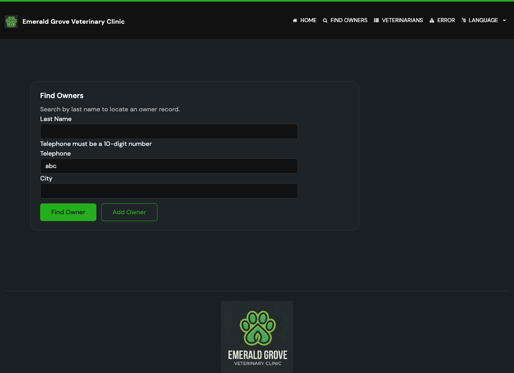

# Task 03 Proofs - Find Owners form: telephone and city inputs

## Task Summary

This task proves the Find Owners form renders optional Telephone and City inputs
alongside the existing Last name input, and clearly displays the telephone
validation message.

## What This Task Proves

- The Find Owners form includes `name="telephone"` and `name="city"` inputs.
- The new inputs use i18n labels (`#{telephone}`, `#{city}`) and the existing
  last-name input/actions are unchanged.
- Submitting an invalid telephone shows a clear validation message on the form.

## Evidence Summary

- `OwnerControllerTests` includes `testInitFindFormHasTelephoneAndCityInputs`
  asserting both inputs render; `I18nPropertiesSyncTest` stays green (labels reuse
  existing keys, no hardcoded strings).
- Two screenshots show the updated form and the invalid-telephone message.

## Artifact: Form-render test + i18n sync

**What it proves:** The template wires the two new inputs and introduces no
non-internationalized strings.

**Why it matters:** Guards the form structure and the project's no-partial-i18n
rule.

**Command:**

```bash
./mvnw test -Dtest=OwnerControllerTests,I18nPropertiesSyncTest
```

**Result summary:** All pass; `testInitFindFormHasTelephoneAndCityInputs`
confirms `name="telephone"` and `name="city"` are present in the rendered form.

## Artifact: Updated Find Owners form

**What it proves:** The form now offers Last name, Telephone, and City inputs.

**Why it matters:** This is the user-facing surface of the feature.

**Artifact path:** `05-proofs/img/find-owners-form.png`

**Result summary:** The form shows the three search inputs with the existing
Find Owner / Add Owner actions.


## Artifact: Invalid telephone validation message

**What it proves:** An invalid telephone (`abc`) is rejected with a clear message.

**Why it matters:** Demonstrates the acceptance criterion for telephone validation.

**Artifact path:** `05-proofs/img/find-owners-invalid-telephone.png`

**Result summary:** The form re-renders with "Telephone must be a 10-digit
number" and no search is performed.



## Reviewer Conclusion

The Find Owners form correctly presents the optional Telephone and City inputs and
surfaces a clear telephone validation message, verified by a render test and
screenshots.
