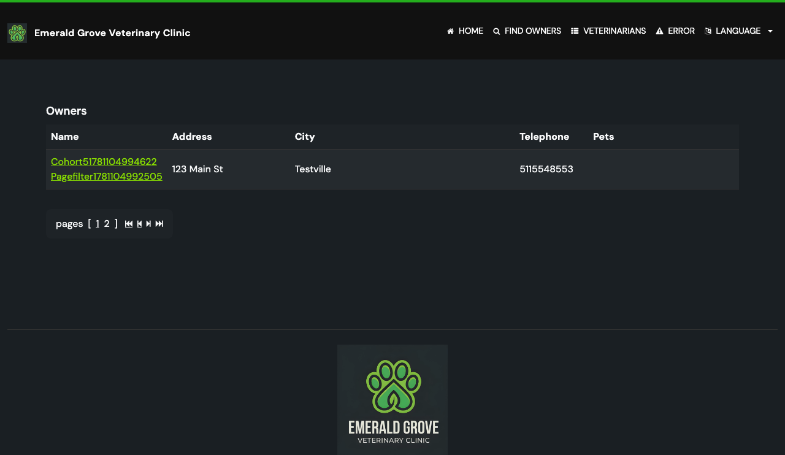
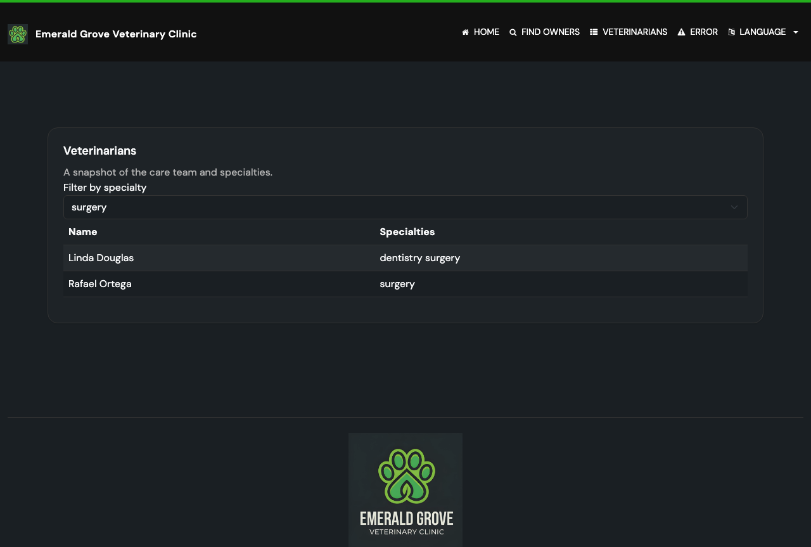

# Task 03 Proofs - End-to-end browser proof for filtered pagination

## Task Summary

This task validates the feature through a real browser. A Playwright spec
applies an Owners filter that spans multiple pages, pages forward and back, and
confirms the filtered result set and filter parameter persist. It also confirms
the Vets specialty filter is carried in the shareable URL.

## What This Task Proves

- Paging through a filtered Owners list keeps the filter: the URL retains
  `lastName=...` and every listed row stays within the filtered set on both
  pages.
- Paging back to page 1 still preserves the filter.
- The Vets specialty filter is reflected in the URL after filtering.

## Evidence Summary

- New spec `preserve-filters-pagination.spec.ts` (2 tests) passes.
- The full e2e suite passes (24 passed, 1 skipped) — no regressions.
- A proof screenshot shows the filtered Owners list on page 2 with the
  pagination control on page 2 and only matching rows.

> Seed data yields fewer than 2 pages for any single owner filter (max 4
> owners share a city) and only one page per vet specialty. To demonstrate a
> real multi-page filtered journey without altering production seed data, the
> Owners test creates a cohort of 6 owners that share a unique generated last
> name (`Pagefilter<timestamp>`), producing exactly 2 pages at page size 5.
> Per the planning audit fallback, the Vets check asserts the filter parameter
> directly (single-page seed data); multi-page vet link preservation is covered
> by the Task 02 unit regression test.

## Artifact: Owners filtered pagination journey

**What it proves:** A filtered Owners search spanning 2 pages keeps the filter
when paging forward to page 2 and back to page 1, with rows staying inside the
filtered set.

**Why it matters:** This is the end-to-end demonstration of the feature in a
real browser, covering the acceptance criteria directly.

**Test:** `preserve-filters-pagination.spec.ts` › "Owners: filtered results stay
filtered when paging forward and back"

**Result summary:** Passing. Asserts page-1 has 5 matching rows and a visible
pagination control; clicking page "2" navigates to a URL matching both
`page=2` and `lastName=Pagefilter<timestamp>`; page 2 shows the remaining
matching row(s); paging back to page "1" keeps `lastName=...` and 5 rows.

**Command:**

```bash
cd e2e-tests && npm test -- preserve-filters-pagination
```

```text
Running 2 tests using 2 workers
  2 passed
```

## Artifact: Filtered Owners list on page 2 (screenshot)

**What it proves:** The Owners list, while filtered, renders a later page with
the pagination control on page 2 and only rows that match the filter.

**Why it matters:** Visual confirmation that paging keeps the user inside the
filtered result set. (Playwright captures page content, not the browser address
bar; the filter-bearing URL is asserted programmatically by `toHaveURL`.)

**Artifact path:** `docs/specs/06-spec-preserve-filters-pagination/06-proofs/img/owners-filtered-page-2.png`

**Result summary:** The screenshot shows pagination `[ 1 2 ]` with page 2 active
and a single row whose name ends in the unique `Pagefilter…` last name,
confirming the filtered page-2 view.



## Artifact: Vets specialty filter preserved in the URL (screenshot)

**What it proves:** Selecting a specialty reflects the filter in the shareable
URL (`?specialty=surgery`) and the dropdown retains the selection.

**Why it matters:** Confirms the vet filter parameter is preserved; combined
with the Task 02 unit test, this covers vet filter persistence across paging.

**Test:** `preserve-filters-pagination.spec.ts` › "Vets: specialty filter is
carried in the URL (link parameter preserved)"

**Artifact path:** `docs/specs/06-spec-preserve-filters-pagination/06-proofs/img/vets-filter-surgery.png`

**Result summary:** Passing. URL matches `[?&]specialty=surgery` and the
dropdown value is `surgery`.



## Artifact: Full e2e suite run

**What it proves:** The new spec passes alongside the rest of the browser suite.

**Why it matters:** Demonstrates no regressions were introduced.

**Command:**

```bash
cd e2e-tests && npm test
```

**Result summary:** `24 passed, 1 skipped`.

## Reviewer Conclusion

The filter-preservation feature works end-to-end in a real browser: a filtered
Owners list keeps its filter across forward and backward pagination, and the
Vets specialty filter is preserved in the URL — all within a fully passing e2e
suite.
