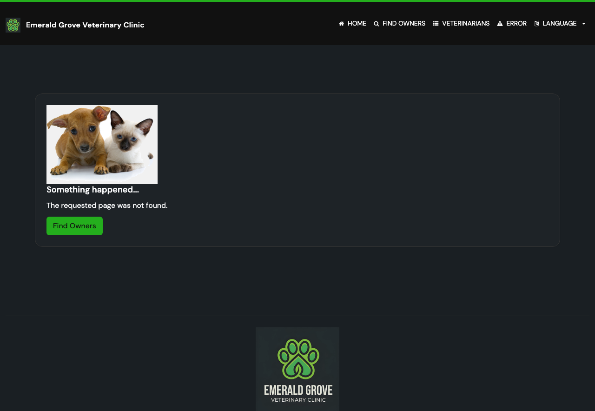

# Task 04 Proofs - End-to-end Playwright proof and full regression

## Task Summary

This task provides end-to-end browser proof of the friendly 404 behavior and
runs the full regression gate. A new Playwright spec verifies the 404 status,
the friendly message, the working Find Owners recovery link, and the absence of
internal exception detail. The full Java test suite and formatting validation
confirm no regressions.

## What This Task Proves

- End-to-end: a real browser request to a non-existent owner/pet returns HTTP
  404 and shows the friendly message (Units 1 & 2).
- End-to-end: the Find Owners recovery link on the error card navigates to
  `/owners/find` (Unit 3).
- Security: the rendered not-found page does not contain the raw exception text
  or exception class name (Unit 1 no-leakage FR).
- No regressions: the full Java suite passes and code is formatting-compliant;
  the existing 500 path (`CrashController`) is unchanged.

## Evidence Summary

- `not-found.spec.ts` runs 4 Playwright tests, all passing.
- A screenshot of the rendered friendly page is captured and stored with the
  proofs.
- `./mvnw test` reports BUILD SUCCESS (86 tests on this branch, 0 failures, 0
  errors, 5 DB-profile tests skipped without Docker), including
  `CrashControllerTests` / `CrashControllerIntegrationTests`.
- `./mvnw spring-javaformat:validate` passes.

## Artifact: Playwright end-to-end suite

**What it proves:** The friendly 404 behavior works through a real browser,
including status, message, recovery link, and no internal-detail leakage.

**Why it matters:** This is the user-facing, end-to-end validation of all three
spec units plus the security requirement.

**Command:**

```bash
cd e2e-tests && npx playwright test not-found.spec.ts
```

**Result summary:** 4 tests passed (owner 404 + message, pet 404 + message,
Find Owners link navigation, no internal-detail leakage).

```text
Running 4 tests using 4 workers
  4 passed (11.7s)
```

## Artifact: Friendly not-found page screenshot

**What it proves:** The rendered page shows "The requested page was not found."
and a "Find Owners" button, with no exception detail or stack trace.

**Why it matters:** Confirms the actual user-facing result a human would see.

**Artifact path:** `docs/specs/07-spec-friendly-404-missing-owner-pet/07-proofs/screenshots/owner-not-found.png`

**Result summary:** The friendly error card renders the localized not-found
message and the green Find Owners recovery button.



## Artifact: Full regression gate

**What it proves:** The change introduces no regressions and complies with the
repository formatting standard; the existing 500 path is intact.

**Why it matters:** The repository pre-commit hook runs the full suite on every
Java commit; this confirms the gate is green.

**Command:**

```bash
./mvnw test
./mvnw spring-javaformat:validate
```

**Result summary:** BUILD SUCCESS, 0 failures/errors;
`CrashControllerIntegrationTests` (the deliberate 500 path) passes; formatting
validation passes.

```text
[INFO] Tests run: 2, Failures: 0, Errors: 0, Skipped: 0 -- in CrashControllerIntegrationTests
[WARNING] Tests run: 86, Failures: 0, Errors: 0, Skipped: 5
[INFO] BUILD SUCCESS
```

## Reviewer Conclusion

The friendly 404 feature is proven end-to-end in a real browser — correct
status, friendly localized message, working recovery link, and no internal
detail leaked — and the full regression gate confirms nothing else broke.
