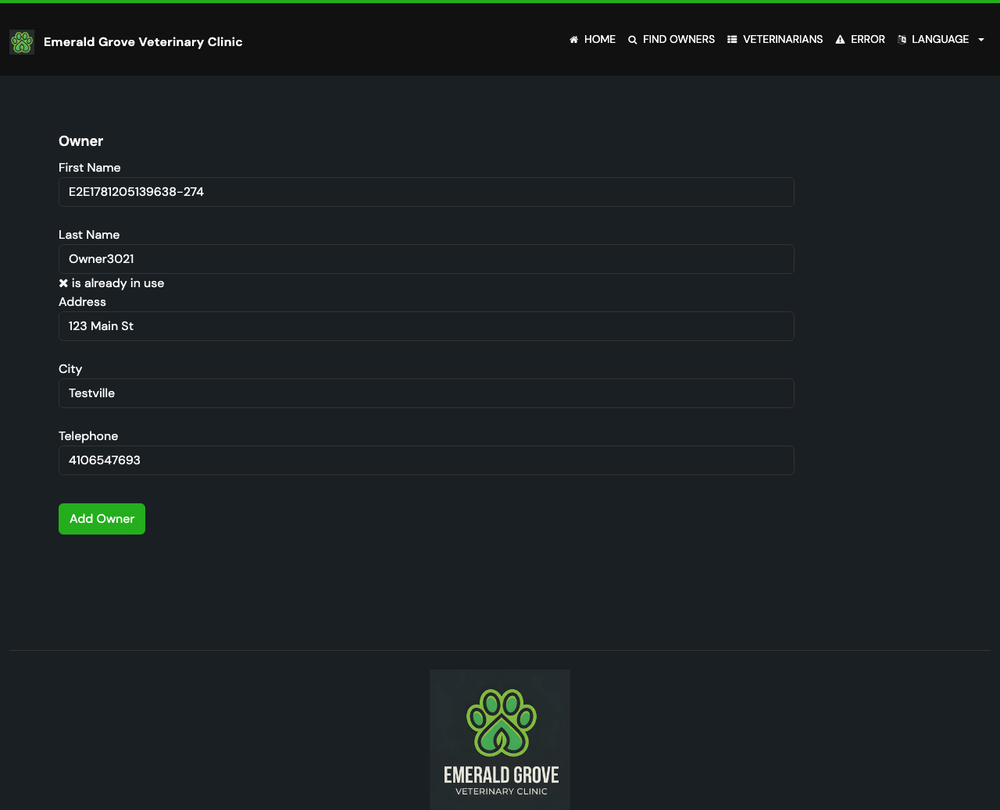

# Task 03 Proofs - End-to-end browser proof (Playwright)

## Task Summary

This task proves, through a real browser against the running application, that
creating an owner twice is blocked: the second attempt shows a visible duplicate
error on the creation form, the user's input is preserved, and no second owner
record is created.

## What This Task Proves

- A new owner can be created successfully (first submission lands on the owner
  details page).
- Submitting the identical owner again is blocked: the creation form is
  redisplayed with the "is already in use" error on the Last Name field, input
  preserved (no redirect to a new details page).
- No duplicate record exists afterward: searching by the unique last name
  resolves to a single owner and redirects directly to that owner's details page
  (`/owners/{id}`), which only happens when exactly one match exists.

## Evidence Summary

- `npx playwright test --grep "Duplicate Owner Prevention" --project=chromium`
  passes (**1 passed**) against a real browser and the running app.
- The captured screenshot shows the duplicate error under the Last Name field
  with all entered values still present.

## Artifact: Playwright duplicate-owner test passes

**What it proves:** The full user-facing flow — create, attempt duplicate, blocked
with error, and single-record verification — works end to end in a real browser.

**Why it matters:** This is the issue's primary demo requirement ("create an
owner, attempt to create the same owner again, assert error") validated against
the actual UI, not just unit mocks.

**Command:**

```bash
cd e2e-tests
npx playwright test --grep "Duplicate Owner Prevention" --project=chromium
```

**Result summary:** PASS — the single test scenario completed successfully.

```text
Running 1 test using 1 worker

[1/1] [chromium] › tests/features/duplicate-owner.spec.ts:7:3 › Duplicate Owner Prevention › blocks creating a duplicate owner and does not create a second record
  1 passed (3.4s)
```

The test (`e2e-tests/tests/features/duplicate-owner.spec.ts`) creates a unique
owner via `createOwner()`, submits it, then submits the identical data again and
asserts the visible duplicate error, the preserved Last Name value, and a
single-owner redirect when searching by that last name.

## Artifact: Duplicate error screenshot

**What it proves:** The duplicate error is visibly presented to the user on the
creation form, with submitted input preserved.

**Why it matters:** Confirms the actionable, input-preserving error UX in the real
rendered page — what an end user actually sees.

**Artifact path:** `docs/specs/07-spec-prevent-duplicate-owner-creation/07-proofs/img/duplicate-owner-error.png`

**Result summary:** The form shows "✖ is already in use" directly under the Last
Name field; First Name, Last Name, Address, City, and Telephone all retain the
submitted values. The data is synthetic (generated by the E2E factory); no
secrets are present.



## Reviewer Conclusion

The end-to-end browser test confirms the complete duplicate-prevention behavior:
a second identical owner submission is blocked with a clear, input-preserving
error, and exactly one record exists afterward. Combined with Tasks 01 and 02,
this fully demonstrates issue #4's acceptance criteria.
