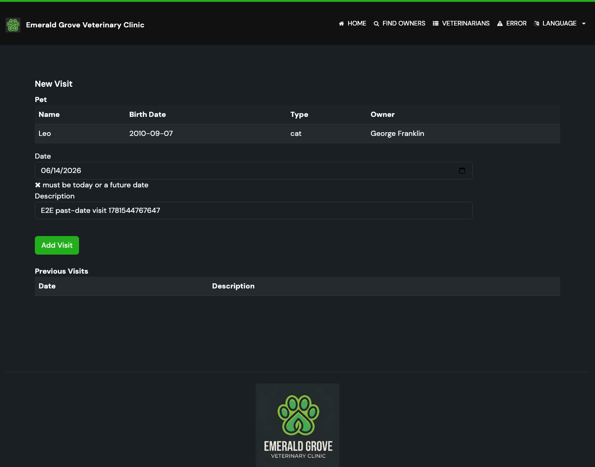

# Task 03 Proofs - End-to-end past-date rejection and regression fix

## Task Summary

This task proves, through a real browser, that submitting a past visit date is
rejected with the localized error, the user stays on the form, and their input is
preserved — while valid (today) visits still succeed. It also removes a
regression: the existing e2e spec hard-coded past calendar dates that the new
rule would now reject, so those dates were switched to computed non-past dates.

## What This Task Proves

- A visit dated yesterday is rejected end-to-end: the inline error
  "must be today or a future date" is shown and the user is not redirected.
- The submitted description is preserved on the re-rendered form.
- The pre-existing "schedule a visit" and "description required" cases still pass
  after switching their hard-coded `2024-...` dates to computed dates (no
  regression introduced by the new rule).

## Evidence Summary

- `npm test -- --grep "Visit Scheduling"` runs 3 tests, all passing, in Chromium.
- A screenshot artifact shows the inline date error, the preserved description,
  and the form still displayed (no redirect).

## Artifact: Visit Scheduling e2e suite passes

**What it proves:** The full visit-scheduling journey — valid booking, required
description, and past-date rejection — works in a real browser.

**Why it matters:** This is the user-facing, end-to-end confirmation that the
validation rule behaves correctly through the actual UI, not just in unit/web
slice tests.

**Command:**

```bash
cd e2e-tests && npm test -- --grep "Visit Scheduling"
```

**Result summary:** 3 tests passed (can schedule a visit; description required;
rejects a visit scheduled in the past).

```text
Running 3 tests using 3 workers
[1/3] ... › can schedule a visit for an existing pet
[2/3] ... › rejects a visit scheduled in the past
[3/3] ... › validates visit description is required
  3 passed (3.3s)
```

## Artifact: Past-date rejection screenshot

**What it proves:** The browser shows the localized error beneath the date field,
keeps the user on the "New Visit" form, and retains the entered description.

**Why it matters:** A reviewer can visually confirm the actionable, user-facing
error without re-running the suite.

**Artifact path:** `docs/specs/08-spec-disallow-past-visit-dates/08-proofs/08-task-03-past-date-rejected.png`

**Result summary:** The date field shows `06/14/2026` (yesterday) with the inline
message "✖ must be today or a future date"; the description field still holds the
submitted value and the form (not the owner page) is displayed.



## Artifact: Regression fix — computed dates replace hard-coded past dates

**What it proves:** The previously hard-coded dates (`2024-02-02`, `2024-03-03`),
which the new rule would reject, were replaced with dates computed relative to
today, so the existing cases remain valid over time.

**Why it matters:** Without this fix the existing suite would start failing purely
because the calendar moved past the hard-coded dates.

**Artifact path:** `e2e-tests/tests/features/visit-scheduling.spec.ts`

**Result summary:** A local `isoDateOffset(days)` helper formats dates as
`yyyy-MM-dd`; happy-path and description-required tests use `isoDateOffset(0)`
(today) and the new test uses `isoDateOffset(-1)` (yesterday).

```ts
function isoDateOffset(days: number): string {
  const date = new Date();
  date.setDate(date.getDate() + days);
  return date.toISOString().slice(0, 10);
}
```

## Reviewer Conclusion

The past-date rule is proven end-to-end in a real browser: past dates are
rejected with a clear localized error and preserved input, valid dates still
succeed, and the existing suite was hardened against date drift.
