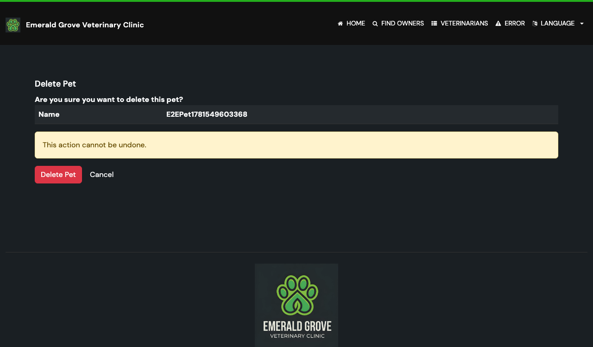

# Task 03 Proofs - Delete action and confirmation page UI

## Task Summary

This task proves the delete flow is reachable and clear in the browser: a
**Delete Pet** link appears for each pet on the owner details page, and a
dedicated confirmation page (`pets/confirmDeletePet.html`) presents the pet, a
"cannot be undone" warning, a conditional visit-count warning, a danger-styled
**Delete Pet** button, and a **Cancel** link back to the owner page.

## What This Task Proves

- The owner details page links to each pet's confirmation page.
- The confirmation page renders the pet name, the warnings, and Delete/Cancel
  controls, all using internationalized message keys (no hard-coded HTML text).
- The visit-count warning appears only when the pet has visits
  (`visitCount > 0`), driven by the model attribute exposed by the controller.

## Evidence Summary

- `owners/ownerDetails.html` now includes a Delete Pet link in the per-pet action
  row (see diff below).
- `pets/confirmDeletePet.html` uses `th:text="#{...}"` for all visible text and
  `#{deletePetVisitsWarning(${visitCount})}` for the parameterized warning.
- `I18nPropertiesSyncTest` (HTML literal scan) passes, confirming no
  non-internationalized strings were introduced.
- The confirmation UI screenshot is captured by the Playwright run in Task 05 and
  stored at `09-proofs/img/confirm-delete-pet.png`.

## Artifact: Owner details Delete Pet link

**What it proves:** The delete action is reachable from the owner page.

**Why it matters:** Without an entry point, the flow cannot be used.

**Artifact path:** `src/main/resources/templates/owners/ownerDetails.html`

**Result summary:** A third action cell links to
`@{__${owner.id}__/pets/__${pet.id}__/delete}` with `th:text="#{deletePet}"`.

```html
<td><a th:href="@{__${owner.id}__/pets/__${pet.id}__/edit}" th:text="#{editPet}">Edit Pet</a></td>
<td><a th:href="@{__${owner.id}__/pets/__${pet.id}__/visits/new}" th:text="#{addVisit}">Add Visit</a></td>
<td><a th:href="@{__${owner.id}__/pets/__${pet.id}__/delete}" th:text="#{deletePet}">Delete Pet</a></td>
```

## Artifact: Confirmation page template

**What it proves:** The confirmation page presents the consequences and the
Delete/Cancel controls, fully internationalized.

**Why it matters:** This is the explicit confirmation step required by the issue.

**Artifact path:** `src/main/resources/templates/pets/confirmDeletePet.html`

**Result summary:** Renders pet name, `#{deletePetWarning}`, a `th:if`-guarded
`#{deletePetVisitsWarning(${visitCount})}`, a `btn btn-danger` submit posting to
the delete endpoint, and a `#{cancel}` link back to the owner page.

## Artifact: Confirmation UI screenshot

**What it proves:** The rendered confirmation page in a real browser.

**Why it matters:** Satisfies the issue's "Screenshot: confirmation UI" proof.

**Artifact path:** `docs/specs/09-spec-delete-pet/09-proofs/img/confirm-delete-pet.png`

**Result summary:** Captured during the Task 05 Playwright run; shows the
confirmation question, warning, and Delete/Cancel buttons.



## Reviewer Conclusion

The delete action is reachable and the confirmation page clearly communicates the
consequences with internationalized text and a danger-styled confirm control,
verified by the i18n HTML scan and the captured screenshot.
