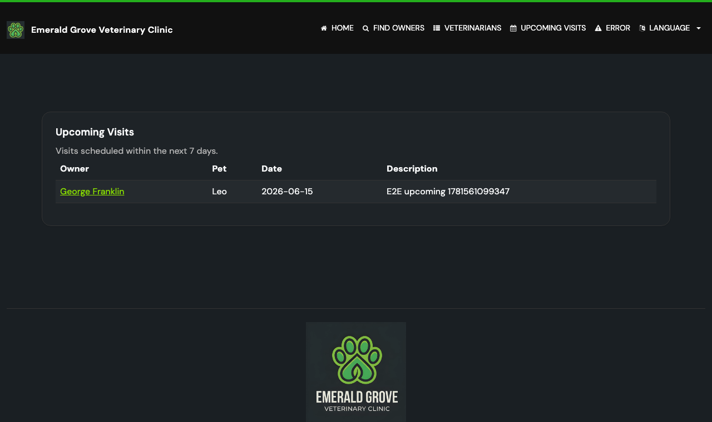

# Task 04 Proofs - End-to-end Playwright proof

## Task Summary

This task proves the Upcoming Visits feature works end-to-end in a real browser:
a visit created within the window appears on `/visits/upcoming`, and the `days`
parameter controls which visits are shown.

## What This Task Proves

- A visit scheduled for today (created through the visit form UI) appears on
  `/visits/upcoming` with the correct owner, pet, date, and description.
- A visit ~20 days out is excluded from the default 7-day window and included
  when the window is widened to `days=30`.
- The rendered page (nav link, heading, localized text, data table) is correct
  in a real browser.

## Evidence Summary

- `upcoming-visits.spec.ts` runs 2 Playwright tests, both pass (3.1s).
- A full-page screenshot shows the populated page with the created visit and the
  active navigation link.

## Artifact: Playwright spec passes

**What it proves:** Both end-to-end journeys (visit appears in window; `days`
controls the window) succeed against the running application.

**Why it matters:** This is the highest-fidelity proof — a real browser driving
the real app and DB, exercising the create-visit flow and the new page together.

**Command:**

```bash
cd e2e-tests && npm test -- --grep "Upcoming Visits"
```

**Result summary:** 2 passed.

```text
Running 2 tests using 2 workers
[1/2] [chromium] › tests/features/upcoming-visits.spec.ts:61:3 › Upcoming Visits › days parameter controls the window
[2/2] [chromium] › tests/features/upcoming-visits.spec.ts:42:3 › Upcoming Visits › shows a visit created within the window
  2 passed (3.1s)
```

| Test | Behavior verified |
| --- | --- |
| `shows a visit created within the window` | A today-dated visit appears with owner/pet/date/description |
| `days parameter controls the window` | +20d visit absent at `days=7`, present at `days=30` |

## Artifact: Rendered page screenshot

**What it proves:** The page renders correctly in a browser — navigation link,
heading, localized subtitle, and a data row for the created visit.

**Why it matters:** Visual confirmation that the feature is usable and the i18n
strings resolve, matching the acceptance criteria (owner, pet, date,
description).

**Artifact path:** `10-task-04-upcoming-visits.png`

**Result summary:** The page shows the "UPCOMING VISITS" nav link (active),
heading "Upcoming Visits", subtitle "Visits scheduled within the next 7 days.",
and a row: George Franklin / Leo / 2026-06-15 / E2E upcoming visit.



## Reviewer Conclusion

The feature is proven end-to-end: a created in-window visit appears on
`/visits/upcoming`, the `days` parameter correctly narrows and widens the
window, and the rendered page is correct and internationalized in a real
browser.
