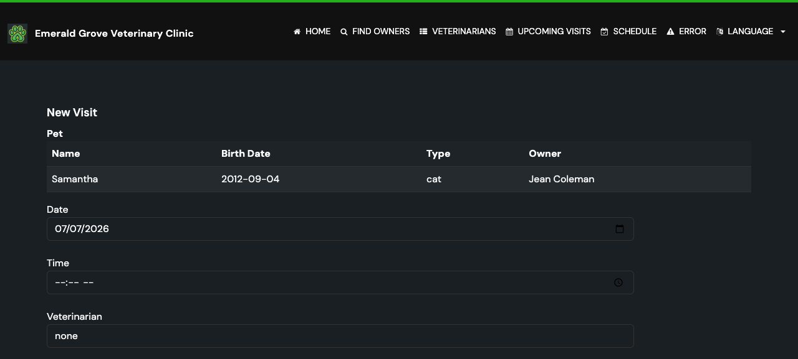

# Task 02 Proofs - Booking Form with Veterinarian Dropdown, Start-Time Input, and Required-Field Validation

## Task Summary

This task extends the booking flow so a new appointment captures a **required** start time
and a **required** veterinarian, while preserving the existing `@FutureOrPresent` date
rule. Missing/invalid vet or time re-renders the form with a localized field error and the
user's input preserved.

## What This Task Proves

- The booking form renders a **Veterinarian** dropdown (from `VetRepository.findAll()`) and
  a **Time** input.
- A `Vet` is bound from the dropdown's id value via a new `VetFormatter` (empty → `null`).
- Missing vet or missing start time produces a field-level validation error and no save.
- The happy path (date + time + vet + description) redirects to the owner page.
- The pre-existing past-date rule and legacy-data behavior are unchanged.

## Evidence Summary

- `VisitControllerTests` (8 tests): happy-path redirect, "vet required" field error,
  "start time required" field error, past-date rejection with preserved input — all pass.
- `VetFormatterTests` (6 tests): valid id → `Vet`, empty/blank → `null`, print → id string,
  not-found and non-numeric → `ParseException` — all pass.
- `ValidatorTests` (4) and `ClinicServiceTests` (15) updated for the new required-fields
  contract and pass; `I18nPropertiesSyncTest` (2) passes with the new keys in all locales.

## Artifact: Booking-form validation and binding tests

**What it proves:** Vet and start time are now required and correctly bound; the happy path
still books; the date rule still fires.

**Why it matters:** This is the core behavioral proof for Unit 1's UI/validation slice.

**Command:**

```bash
./mvnw test -Dtest="VetFormatterTests,VisitControllerTests,ValidatorTests,ClinicServiceTests,I18nPropertiesSyncTest"
```

**Result summary:** 35 tests, 0 failures.

```text
[INFO] Tests run: 8, Failures: 0, Errors: 0, Skipped: 0 -- in VisitControllerTests
[INFO] Tests run: 6, Failures: 0, Errors: 0, Skipped: 0 -- in VetFormatterTests
[INFO] Tests run: 2, Failures: 0, Errors: 0, Skipped: 0 -- in I18nPropertiesSyncTest
[INFO] Tests run: 4, Failures: 0, Errors: 0, Skipped: 0 -- in ValidatorTests
[INFO] Tests run: 15, Failures: 0, Errors: 0, Skipped: 0 -- in ClinicServiceTests
[INFO] Tests run: 35, Failures: 0, Errors: 0, Skipped: 0
[INFO] BUILD SUCCESS
```

## Artifact: Booking form UI (Veterinarian dropdown + Time input)

**What it proves:** The form exposes the new Time input and Veterinarian dropdown.

**Why it matters:** Confirms the feature is visible in the actual user-facing UI, not just
in the controller.

**Artifact path:** `docs/specs/12-spec-calendar-appointment-booking/12-proofs/images/booking-form.png`

**Result summary:** Captured in the consolidated UI verification pass (see Task 04 proofs),
which boots the app once and screenshots the booking form, the conflict error, and the
schedule page together. Image embedded below once captured.



## Reviewer Conclusion

New appointments now require a vet and a start time, bound and validated on the server with
localized errors and preserved input, without regressing the existing date rule.
