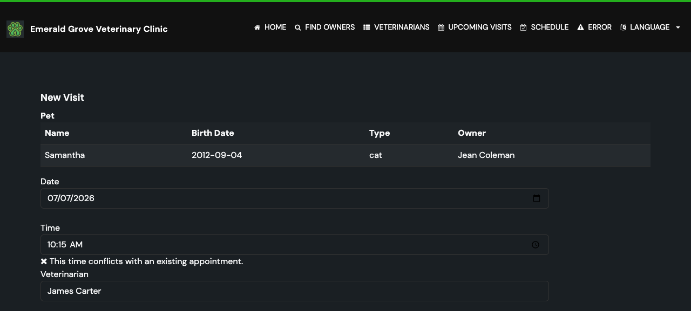

# Task 03 Proofs - Conflict Detection (No Double-Booking)

## Task Summary

This task adds server-side conflict detection so a new appointment cannot overlap an
existing one for the **same veterinarian** or the **same pet** on the same date. Overlap
uses the half-open rule `startA < endB && startB < endA` (each `end = start + 30 min`), so
back-to-back appointments are allowed. Legacy null-vet rows never produce a false vet
conflict.

## What This Task Proves

- The pure overlap rule is correct at every boundary (identical start, partial overlap in
  either order, back-to-back in either order, fully separate) — full branch coverage.
- An overlapping same-vet booking is rejected with a field error and nothing is saved.
- An overlapping same-pet booking is rejected with a field error and nothing is saved.
- A back-to-back booking (09:30 after a 09:00–09:30) is accepted.
- The repository queries return the right rows and **exclude** legacy null-vet rows from the
  vet query while still surfacing them in the pet query.

## Evidence Summary

- `AppointmentConflictDetectorTests` (6): the overlap rule passes all boundary cases.
- `VisitControllerTests` (11): vet-conflict and pet-conflict rejections (no save),
  back-to-back allowed, plus the earlier validation/happy-path cases.
- `ClinicServiceTests` (17): `findByVetAndDate`/`findByPetAndDate` return expected rows;
  a legacy null-vet seed row is excluded from the vet query but found by the pet query.

## Artifact: Conflict rule + controller + repository tests

**What it proves:** Double-booking is blocked for both vet and pet, back-to-back is
allowed, and the overlap math is exhaustively covered.

**Why it matters:** This is the safety-critical behavior of the feature (Success Metric 1:
100% of overlapping bookings rejected with no save).

**Command:**

```bash
./mvnw test -Dtest="AppointmentConflictDetectorTests,VisitControllerTests,ClinicServiceTests,I18nPropertiesSyncTest"
```

**Result summary:** 36 tests, 0 failures.

```text
[INFO] Tests run: 6,  Failures: 0, Errors: 0, Skipped: 0 -- in AppointmentConflictDetectorTests
[INFO] Tests run: 11, Failures: 0, Errors: 0, Skipped: 0 -- in VisitControllerTests
[INFO] Tests run: 2,  Failures: 0, Errors: 0, Skipped: 0 -- in I18nPropertiesSyncTest
[INFO] Tests run: 17, Failures: 0, Errors: 0, Skipped: 0 -- in ClinicServiceTests
[INFO] Tests run: 36, Failures: 0, Errors: 0, Skipped: 0
[INFO] BUILD SUCCESS
```

## Artifact: Half-open overlap rule (100% branch)

**What it proves:** Both branches of `startA.isBefore(endB) && startB.isBefore(endA)` are
exercised: `backToBackAppointmentsDoNotConflictReversed` forces the first operand false,
`backToBackAppointmentsDoNotConflict` forces the second false, and the overlap cases force
both true.

**Why it matters:** The spec requires 100% branch coverage on this critical logic.

**Artifact path:** `src/test/java/org/springframework/samples/petclinic/owner/AppointmentConflictDetectorTests.java`

**Result summary:** 6 boundary tests pass, covering both short-circuit branches and both
outcomes.

## Artifact: Conflict error in the UI

**What it proves:** The conflict produces a user-visible, localized error on the form.

**Why it matters:** Confirms the rejection is surfaced to the receptionist, not silent.

**Artifact path:** `docs/specs/12-spec-calendar-appointment-booking/12-proofs/images/conflict-error.png`

**Result summary:** Captured against the running app. Attempting to book Samantha at 10:15
when she already has a 10:00 appointment re-renders the form with the localized message
"This time conflicts with an existing appointment." under the Time field, with the entered
values preserved.



## Reviewer Conclusion

Overlapping vet and pet bookings are reliably rejected server-side with a localized error
and no save, back-to-back slots are allowed, and legacy null-vet data cannot cause false
vet conflicts.
