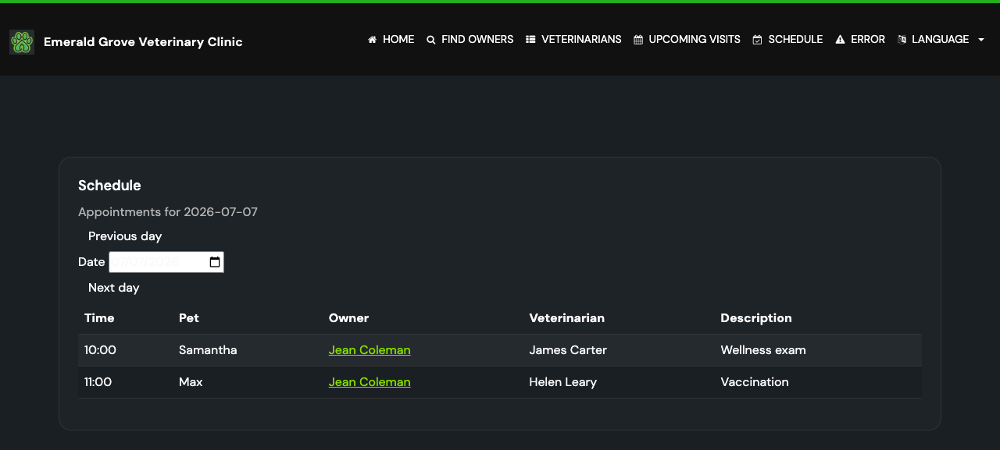
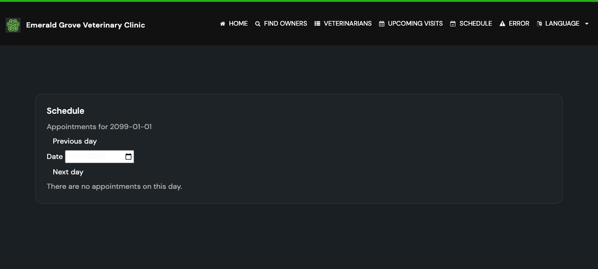

# Task 04 Proofs - Clinic-Wide Day Schedule Page

## Task Summary

This task adds a read-only `GET /schedule` page listing every appointment on a single date,
defaulting to today and accepting an optional `date=yyyy-MM-dd` (invalid/blank → today). It
projects appointments clinic-wide ordered by start time then vet, renders a table with an
empty state and prev/next-day navigation, and adds a nav-bar entry.

## What This Task Proves

- `GET /schedule` returns the schedule view with today's appointments by default.
- `?date=YYYY-MM-DD` shows that day's appointments; invalid/blank date falls back to today.
- The clinic-wide query returns rows across vets/pets ordered by start time, and includes
  legacy null-vet appointments (left join).
- Prev/next-day model values are computed; an empty day shows the empty state.
- The page is reachable from the nav bar and uses the shared layout + Liatrio styling.

## Evidence Summary

- `ScheduleControllerTests` (5): default→today, `?date=` valid (with order preserved and
  prev/next values), invalid→today, blank→today, empty→empty-state.
- `ClinicServiceTests` (18): the clinic-wide `findScheduledAppointmentsByDate` returns rows
  ordered by start time with the vet name populated.
- `I18nPropertiesSyncTest` (2) and `LanguageSelectorViewTests` (2) pass with the new nav
  entry and schedule message keys.

## Artifact: Schedule route + query tests

**What it proves:** The route, resilient date handling, ordering pass-through, and the
clinic-wide query all behave as specified.

**Why it matters:** These are the core behaviors of Unit 3.

**Command:**

```bash
./mvnw test -Dtest="ScheduleControllerTests,ClinicServiceTests,I18nPropertiesSyncTest,LanguageSelectorViewTests"
```

**Result summary:** 27 tests, 0 failures.

```text
[INFO] Tests run: 5,  Failures: 0, Errors: 0, Skipped: 0 -- in ScheduleControllerTests
[INFO] Tests run: 2,  Failures: 0, Errors: 0, Skipped: 0 -- in LanguageSelectorViewTests
[INFO] Tests run: 2,  Failures: 0, Errors: 0, Skipped: 0 -- in I18nPropertiesSyncTest
[INFO] Tests run: 18, Failures: 0, Errors: 0, Skipped: 0 -- in ClinicServiceTests
[INFO] Tests run: 27, Failures: 0, Errors: 0, Skipped: 0
[INFO] BUILD SUCCESS
```

## Consolidated UI Verification (Tasks 2–4)

The booking-form, conflict-error, and schedule screenshots are captured together in one
app session (booting Spring Boot once) and stored under `images/`. Each is referenced from
its owning task's proof file.

## Artifact: Populated day schedule

**What it proves:** The schedule renders appointments ordered by time with owner links, the
vet column, and prev/next-day navigation.

**Artifact path:** `docs/specs/12-spec-calendar-appointment-booking/12-proofs/images/schedule-populated.png`



## Artifact: Empty-state day schedule

**What it proves:** A day with no appointments shows the localized empty-state message.

**Artifact path:** `docs/specs/12-spec-calendar-appointment-booking/12-proofs/images/schedule-empty.png`



## Reviewer Conclusion

The clinic-wide day schedule is a working, resilient, read-only page: it lists a day's
appointments in chronological order, navigates between days, handles bad input gracefully,
and is reachable from the nav bar.
